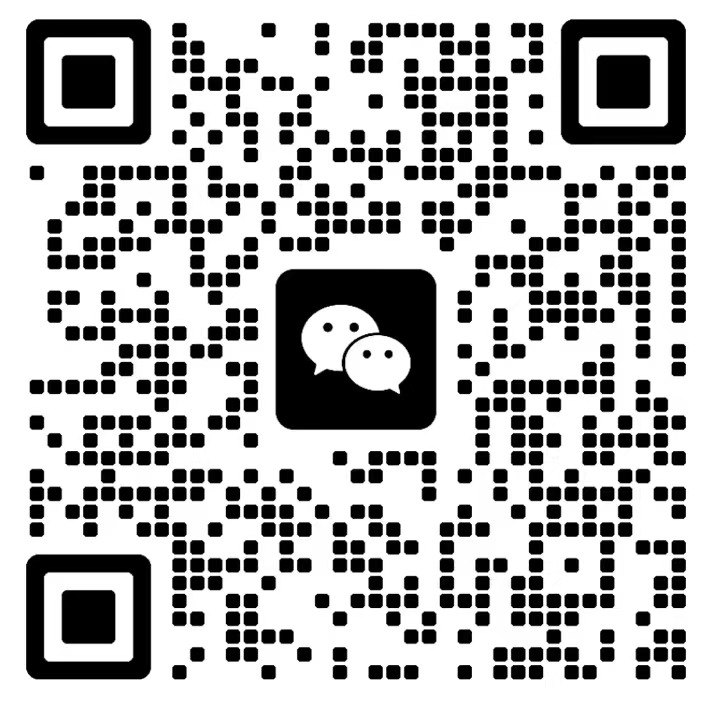

I'm a third year graduate student from [Lanzhou University of Finance and Economics](https://www.lzufe.edu.cn/index.htm), [School of Accounting](https://www.lzufe.edu.cn/index.htm). My major is Auditing.

My research interest lies in the intersection of computer science and management, focusing on applying machine learning, neural networks, and network analysis to solve problems in accounting, auditing, and finance.

I am fortunate to be advised by [Prof. Cheng Gui](https://xueshu.baidu.com/scholarID/CN-B7HA4JDK), the Dean of the School of Finance, and [Prof. Lu Haiyan](https://a.xueshu.baidu.com/scholarID/CN-BEG838KK), the Dean of the School of Accounting.

You can find my CV here: [Shuhe Zhu's Curriculum Vitae](../assets/shuhe_cv.pdf).

[Email](mailto:zhushuhe0224@gmail.com) / [GitHub](https://github.com/zhucharlotte) / 
